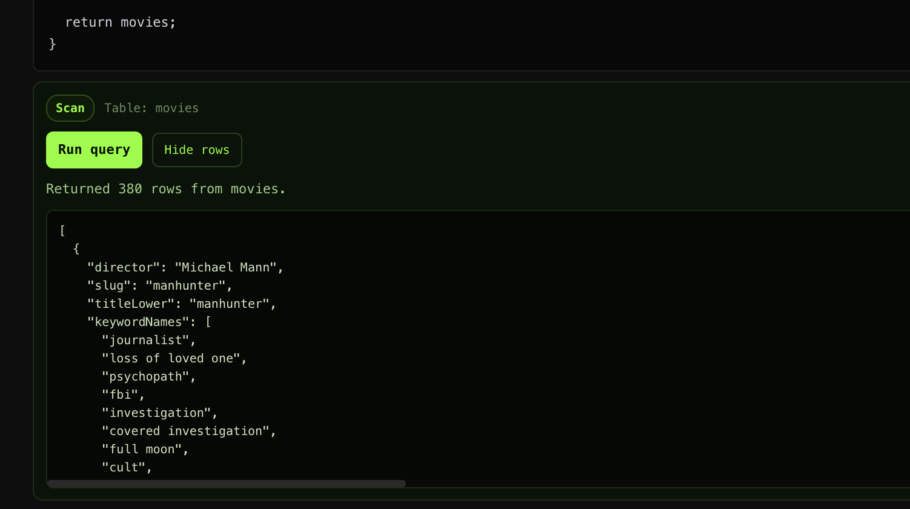
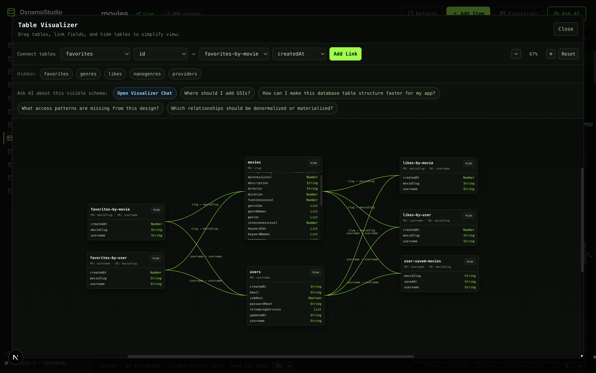
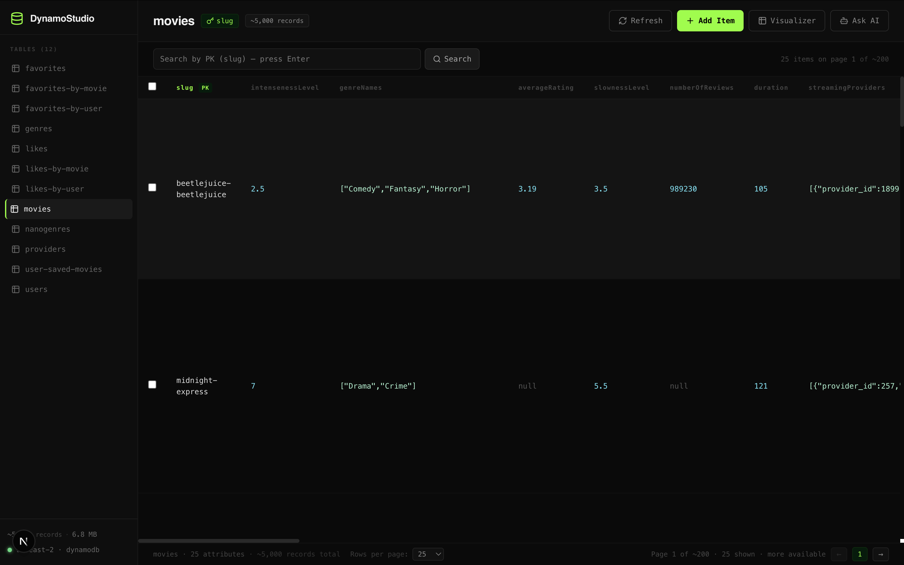
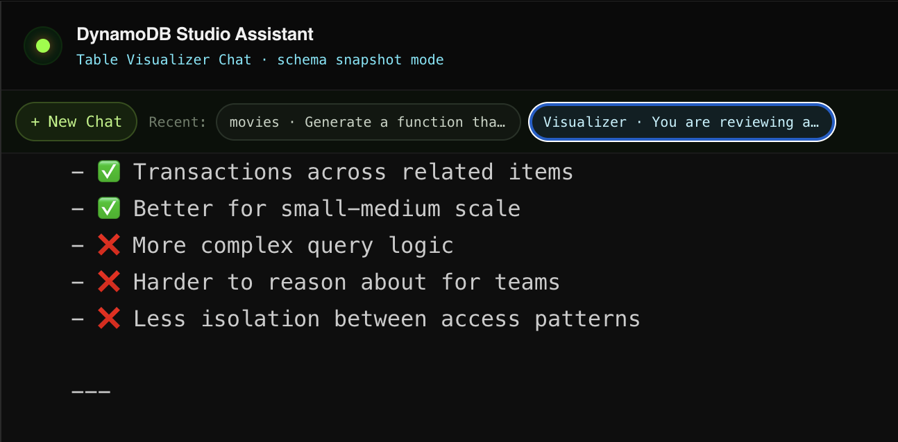

# DynamoStudio

DynamoStudio is a Next.js web app for exploring and managing AWS DynamoDB tables with an integrated AI assistant.

It combines:
- A table browser with schema and approximate table stats
- Item-level CRUD (create, edit, delete)
- Search and pagination for browsing records
- A visual table relationship workspace (Table Visualizer)
- An AI chat assistant (Mastra + Anthropic) that can now run DynamoDB queries directly from chat
- Local persistence of key UI/chat state via `localStorage`

## Highlights

### 1. AI Chat with Run Query

The AI assistant can return runnable operation payloads (Query/Scan/GetItem/PutItem/UpdateItem/DeleteItem) and lets you execute them directly in-chat.

- Detects runnable payloads in AI responses
- Prompts for missing runtime inputs when needed
- Executes via backend API and shows result rows inline
- Supports both table-context chat and visualizer-context chat threads



### 2. Table Visualizer

The visualizer provides a schema map workflow for multi-table design analysis.

- Drag/reposition table cards
- Create and edit links between table fields
- Hide/show tables to simplify the graph
- Ask AI questions from the visualizer snapshot
- Open a dedicated Visualizer Chat and resume visualizer chat history



### 3. Local Storage Persistence

DynamoStudio persists user state to improve continuity across reloads/restarts.

- Main table view state:
  - `activeTable`
  - `pageSize`
  - `sortCol` / `sortDir`
  - `activeSearch`
- Table Visualizer state:
  - card positions
  - field links
  - hidden tables
- AI Chat history:
  - per-table chat threads
  - visualizer chat threads
  - migration support for legacy visualizer history key





## Tech Stack

- Next.js (App Router)
- React + TypeScript
- AWS SDK v3 (`@aws-sdk/client-dynamodb`, `@aws-sdk/lib-dynamodb`)
- Mastra agent framework
- Anthropic model via AI SDK

## Prerequisites

- Node.js 18+
- AWS account credentials with DynamoDB access
- Anthropic API key (required for AI chat features)

## Environment Variables

Create `.env.local` in the project root:

```bash
AWS_REGION=us-east-1
AWS_ACCESS_KEY_ID=your_access_key_id
AWS_SECRET_ACCESS_KEY=your_secret_access_key
ANTHROPIC_API_KEY=your_anthropic_api_key
```

### Minimum AWS IAM Permissions

The app/API use these DynamoDB operations:
- `dynamodb:ListTables`
- `dynamodb:DescribeTable`
- `dynamodb:Scan`
- `dynamodb:Query`
- `dynamodb:PutItem`
- `dynamodb:DeleteItem`

## Getting Started

1. Install dependencies:

```bash
npm install
```

2. Add `.env.local` with the variables above.

3. Start the development server:

```bash
npm run dev
```

4. Open [http://localhost:3000](http://localhost:3000)

## Build and Run Production

```bash
npm run build
npm run start
```

## Example Use Cases

1. Inspect a table quickly
- Select a table from the sidebar
- Review PK/SK, GSIs, and approximate record count
- Browse records page-by-page

2. Fix bad data in-place
- Search by key prefix/value
- Open the row editor
- Update attributes and save

3. Clean test data
- Select multiple rows with checkboxes
- Bulk delete test items

4. Analyze architecture with the visualizer
- Open `Visualizer`
- Connect table fields and hide noisy tables
- Ask AI for missing access patterns and GSI recommendations

5. Execute AI-generated operations
- Open `Ask AI`
- Request a query/scan for your use case
- Run directly from the result card and inspect returned rows

## API Overview

- `GET /api/tables` → list table names
- `GET /api/tables/[name]` → table schema summary (PK/SK/GSI names)
- `GET /api/tables/[name]/meta` → approximate `itemCount` and `sizeBytes`
- `GET /api/tables/[name]/items` → paginated item fetch/search
- `POST /api/tables/[name]/items` → create/update item
- `DELETE /api/tables/[name]/items` → delete item by key
- `GET /api/region` → current AWS region from env
- `POST /api/agent` → stream AI chat responses
- `POST /api/agent/execute` → execute AI-generated DynamoDB operation payloads
- `GET /api/tables/visualizer` → table/field metadata for visualizer

## Project Structure

```text
app/
  api/
    agent/
      route.ts
      execute/route.ts
    region/route.ts
    tables/
      route.ts
      visualizer/route.ts
      [name]/
        route.ts
        items/route.ts
        meta/route.ts
  lib/dynamo.ts
  page.tsx
components/
  AgentChat.tsx
  TableVisualizer.tsx
  DynamoStudio.tsx
mastra/
  agents/dynamoAgent.ts
  tools/dynamoTools.ts
```

## Notes and Limitations

- Table counts/sizes from `DescribeTable` are approximate and not real-time.
- Search can fall back to scans depending on table shape and query term.
- AI features require `ANTHROPIC_API_KEY`; without it, the core table UI still works.
- This project currently stores AWS credentials in env vars for local/dev convenience. For production, prefer IAM roles or a secure secrets manager.

## Troubleshooting

- “Failed to connect to DynamoDB”:
  - Verify AWS credentials and region in `.env.local`
  - Confirm IAM permissions listed above

- AI chat not responding:
  - Verify `ANTHROPIC_API_KEY`
  - Check server logs for `/api/agent` errors

- AI Run Query fails:
  - Confirm operation permissions for the active credentials
  - Validate runtime input fields in the execution card

- No tables found:
  - Confirm region points to where your tables exist

## License

No license file is currently included. Add one (for example, MIT) before open-source distribution.
